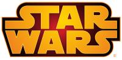

# Star Wars - Quiz &middot; [](https://travis-ci.org/npm/npm) [](https://www.npmjs.com/package/npm) [](http://makeapullrequest.com) [](https://github.com/your/your-project/blob/master/LICENSE)
>

Quiz with the characters of Star Wars.

## Installing / Getting started

To do the installation follow the steps below:

```shell
git clone https://github.com/lcelso/star-wars-quiz
cd star-wars-quiz
npm install

or

yarn
```


## Developing

### Built With
This project used: Next.js: v9.3.4, Apollo Client: 2.6.8, React: 16.13.1, Styled Components: 5.1.0, Graphql: 15.0.0


### Setting up Dev

```shell
npm dev

or

yarn dev
```

Access url: http://localhost:3000 to access the application and http://localhost:3000/api/graphql to access the graphql Playground.


## Building

```shell
yarn build

or

npm build
```

### Prod
It is necessary to have already performed the build.

```shell
yarn start

or

npm start
```


## Tests

```shell
yarn test 
yarn test:watch
yarn test:coverage
```

## Api Reference

Using the api: https://swapi.co/, but the same is off the air.

Currently the application is using a mock, which can be found in the folder.

```shel
apollo/utils/chars-mock.js
```

## Licensing

MIT